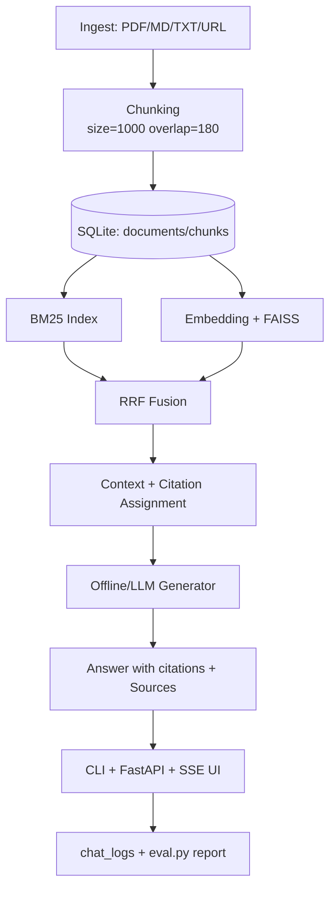

# TraceRAG

TraceRAG 是一个可本地运行、可评估、可演示的 RAG 项目，重点突出：
- **Hybrid Retrieval**：BM25 + 向量检索 + RRF 融合
- **可追溯引用**：答案内 `[1][2]...` + Sources 明细（source/page/heading/chunk_id）
- **SSE 流式体验**：FastAPI `/chat` 分阶段推送 status/delta/sources
- **可评估性**：`eval.py` 输出 Recall@k、MRR、citation coverage

---

## 1) Architecture



---

## 2) Quickstart（3 条命令）

```bash
pip install -e .[dev]
tracerag ingest --path data/
tracerag serve
```

然后访问：
- `http://127.0.0.1:8000/`（Web Demo）
- `curl http://127.0.0.1:8000/health`

---

## 3) Demo 预期输出

### CLI
```bash
tracerag query "TraceRAG 的融合检索是什么？" --top-k 6
```
预期：
- 输出多段证据摘要
- 每段结尾带引用标号，如 `[1]`
- 末尾 `Sources` 列表，格式：
  - `[1] title - source - page/heading - chunk_id`

### SSE API
```bash
curl -N -X POST "http://127.0.0.1:8000/chat" \
  -H "Content-Type: application/json" \
  -d '{"query":"什么是 Hybrid Retrieval?", "top_k":6}'
```
预期事件顺序：
- `event: status`（retrieving/generating/done）
- `event: delta`（流式文本）
- `event: sources`（最终来源）
- `event: done`

---

## 4) 评估（Milestone 5）

```bash
python eval.py
```
读取 `data/eval_set.jsonl`，输出并写入 `reports/eval_report.json`：
- `Recall@k`（有 expected_source 时）
- `MRR`（有 expected_source 时）
- `citation_coverage`
- `avg_citation_markers`

---

## 5) 设计决策（Why）

1. **Chunk size=1000 / overlap=180**
   - 兼顾上下文完整性与召回粒度；overlap 降低跨 chunk 语义断裂。
2. **RRF 融合而非手工加权**
   - 对 BM25 与语义分数尺度不敏感，实现简单、鲁棒性高。
3. **OfflineGenerator 默认开启**
   - 保证离线可运行/可测试，不依赖外部 LLM 与密钥。
4. **FAISS 采用“全量重建”策略**
   - 在当前规模下优先保证正确性与可维护性，避免删除向量复杂度。

更多细节见：
- `docs/architecture.md`
- `docs/design_decisions.md`

---

## 6) Resume Bullets（中英双语，可直接使用）

1. 设计并实现 TraceRAG 本地知识问答系统，落地 BM25+FAISS+RRF 混合检索链路，显著提升多类型文档场景下的召回稳定性。  
   Built TraceRAG with a BM25+FAISS+RRF hybrid retrieval pipeline, improving recall robustness across heterogeneous local documents.

2. 构建可追溯引用机制（答案内引用 + Sources 明细到 chunk_id/page/heading），将“可解释性”嵌入生成链路。  
   Implemented end-to-end citation traceability (inline citations + source breakdown to chunk_id/page/heading) for explainable RAG outputs.

3. 开发 FastAPI + SSE 流式服务，支持 status/delta/sources 分阶段输出，并通过 request_id + latency 分解实现在线可观测性。  
   Developed a FastAPI SSE service with staged events (status/delta/sources) and request-level observability via request_id and latency breakdown.

4. 设计增量入库与去重机制（source+hash），支持文档更新时稳定追踪 doc_id，并自动重建检索索引保证一致性。  
   Designed incremental ingestion and dedup (source+hash) with stable doc tracking and automatic index rebuild for consistency on document updates.

5. 搭建轻量评估框架（Recall@k、MRR、citation coverage）与样例评测集，实现“检索-生成-可解释性”统一量化。  
   Built a lightweight evaluation harness (Recall@k, MRR, citation coverage) with sample datasets to quantify retrieval, generation, and explainability together.

---

## 7) Interview Q&A（10 个高频追问）

1. **为什么要做 Hybrid Retrieval？**  
   要点：BM25 擅长关键词精确匹配，向量检索擅长语义相似；两者互补。

2. **RRF 的优势是什么？**  
   要点：不需要统一分数尺度；仅依赖 rank；对系统迁移更稳。

3. **为什么 chunk 不是越大越好？**  
   要点：大 chunk 降低定位精度，小 chunk 丢上下文；1000/180 是折中。

4. **如何降低 hallucination？**  
   要点：强制仅基于 context 回答、无证据时回答不知道、必须带引用。

5. **为什么要做离线生成器？**  
   要点：保证无外网/无密钥也能跑通 demo、CI 和单测。

6. **增量去重怎么做？**  
   要点：source+content hash；不变跳过，变化则更新文档并替换 chunks。

7. **为什么 FAISS 先全量重建？**  
   要点：实现简洁、避免 tombstone 复杂性；对中小规模足够。

8. **评估指标为什么选 Recall@k + MRR？**  
   要点：Recall@k 看命中率，MRR 看命中位置；两者组合更全面。

9. **citation coverage 有什么意义？**  
   要点：约束答案可解释程度，监控“有答案但无证据”的风险。

10. **后续如何扩展？**  
   要点：接入 reranker、Qdrant/pgvector、在线 A/B、LLM provider 抽象化。
